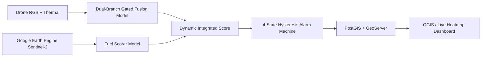

# Early Fire Detection and Rapid Response System with Thermal Imaging and AI-Based Mapping for Aerial Platforms

## Asude Dila Açkgöz - asudedila12@gmail.com
## İlknur Nazlı Koşar - ilknurnazlikosar@gmail.com
## Serhat Erdoğan - serhaterdogan500@gmail.com

## Overview

This project is an end-to-end, modular early warning and decision support system designed for integration into aerial platforms (Drones/UAVs). It processes **RGB + Thermal dual-modal camera streams** using deep learning, calculates real-time vegetation flammability risk using **Google Earth Engine (Sentinel-2)** satellite data, and maps detections live onto **Geographic Information System (GIS)** dashboards via **PostGIS / GeoServer**.

This R&D project is supported by the **TUSAŞ (Turkish Aerospace Industries) LİFT-UP Program** and **TÜBİTAK**.

---

## System Architecture

Our system comprises **5 main layers**: image processing, satellite integration, intelligent stream policy, thermal segmentation, and geospatial mapping:



---

## Key Features and Layers

### 1. Dual-Branch Gated Fusion Architecture (`dual_branch_gated_fusion.py`)
* Processes RGB (3-channel) and Thermal (1-channel) data synchronously using **ResNet18, ResNet50, and EfficientNet-B0** backbones.
* The first convolutional layer of the thermal stem is adapted to 1 channel using pretrained RGB weights (`mean_rgb`).
* **Gate MLP:** Dynamically weights the 512-dimensional feature embeddings (total 1024-d) from both sensors. It automatically shifts reliance toward thermal when heavy smoke or sun glare obstructs RGB, and toward RGB when thermal noise or solar-heated rocks mislead the thermal sensor.

### 2. Satellite-Assisted Vegetation Flammability Model (`fuel_scorer.py`)
* Extracts real-time **NDVI (Normalized Difference Vegetation Index)**, **NDMI (Normalized Difference Moisture Index)**, and **Dynamic World** land cover classes via Google Earth Engine (GEE) for the exact drone coordinates.
* Trained **Logistic Regression** and **Random Forest** models calculate a regional dryness and flammability risk score. This score dynamically calibrates the camera model's probability output ($\pm\%5$ effect).

### 3. Intelligent Video Stream Policy & Hysteresis Alarm (`rt_stream_policy.py`, `alarm.py`)
* **DroneRTStreamPolicy:** Instead of running heavy inference on every single frame, it performs selective inference triggered by scene changes (MAE > 0.10) or motion spikes, carrying over previous predictions on similar frames.
* **4-State Hysteresis (`IDLE` ➔ `SUSPECTED` ➔ `CONFIRMED` ➔ `COOLDOWN`):** Eliminates single-frame false positives. Entering the `CONFIRMED` alarm state requires sustained high probability across consecutive frames.

### 4. Thermal Segmentation and Risk Scoring (`thermal_threshold.py`)
* Applies hybrid thresholding (`percentile`, `fixed`, `hybrid`) on thermal frames.
* Performs morphological operations (**Opening, Closing, Dilation**) to generate pixel-level fire masks, calculating an explainable risk score based on component area and peak temperature intensity.

### 5. Geospatial Projection, Optical Flow, and GIS Mapping (`pixel_projection.py`, `drone_coordinate.py`)
* **Trigonometric Projection:** Converts 2D fire pixels on the screen into real-world **WGS84** coordinates using drone altitude, horizontal/vertical FOV, and compass heading.
* **Optical Flow (Lucas-Kanade):** Tracks drone movement in meters directly from video frames to maintain coordinate tracking even during GPS signal loss.
* **PostGIS & GeoServer:** Stores spatial records (`drone_frame_points`, `fire_observations`, `active_fire_tracks`) in the database and streams them as a **Live Heatmap in QGIS and the Streamlit interface**. Command center operators can click on map points to directly inspect the exact video frames corresponding to those coordinates.

---

## Installation and Usage

### 1. Requirements Setup
Create a Python 3.9+ virtual environment and install the required dependencies:
```bash
git clone https://github.com/USERNAME/Early-Fire-Detection-and-Mapping.git
cd Early-Fire-Detection-and-Mapping-main
python -m venv venv
venv\Scripts\activate
pip install -r requirements.txt
```

### 2. Environment Variables (`.env`)
Create an `.env` file in the project root directory and add your PostGIS and GeoServer connection parameters:
```ini
POSTGIS_HOST=localhost
POSTGIS_PORT=5432
POSTGIS_DB=wildfire_db
POSTGIS_USER=postgres
POSTGIS_PASSWORD=your_password
GEOSERVER_URL=http://localhost:8080/geoserver
GEE_PROJECT_ID=your-gee-project-id
```

### 3. Running the Web Dashboard (Streamlit)
To start the interactive UI for video analysis, risk graphs, and CSV exports:
```bash
streamlit run src/ui/app.py
```

### 4. End-to-End Video Inference and PostGIS Mapping
To run video prediction and stream spatial detections directly to the database and map:
```bash
python web-dashboard/connect-and-show-qgis/process_video_to_db.py
```

---

## Acknowledgments and Team

We extend our deepest gratitude to the **TUSAŞ (Turkish Aerospace Industries) LİFT-UP Program** and **TÜBİTAK** for their valuable support in realizing this R&D project.

**Project Team and Advisors:**
* **Academic Advisor:** Fatma Yerlikaya Öztürk
* **Industrial Advisor:** Kadir Durdu
* **Project Team:** Asude Dila Açıkgöz, İlknur Nazlı Koşar, Serhat

---
<div align="center">
  <p><i>This project was developed to advance early warning capabilities and autonomous GIS mapping in the fight against wildfires.</i></p>
</div>
